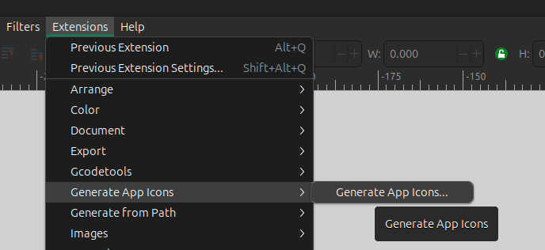
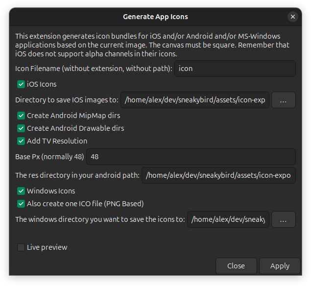

# Inkscape App Icon Generator

This is an [Inkscape](https://inkscape.org/) plugin for the bulk export of application icons in multiple sizes.  
Originally created by [@ScreamingTaco](https://github.com/ScreamingTaco) and later updated by
[@firephreek](https://github.com/firephreek). I've just added 512px size for Windows.
These contributors made life significantly easier for others.

## WARNING

This plugin is OBSOLETE and is NO LONGER COMPATIBLE with the latest version of Inkscape.  

## Installation

Place the `app_icon.inx` and `app_icon.py` files in the Inkscape extensions directory.

On Ubuntu, the directory is typically located at `~/.config/inkscape/extensions/`.  
You can install the plugin by running the following commands:

```shell
mkdir -p ~/.config/inkscape/extensions
pushd ~/.config/inkscape/extensions
wget https://raw.githubusercontent.com/akabanov/inkscape_app_icon_generator/master/app_icon_generator.inx
wget https://raw.githubusercontent.com/akabanov/inkscape_app_icon_generator/master/app_icon_generator.py
chmod +x app_icon_generator.py
popd
```

Then, (re)start Inkscape.

## Usage

When you have your icon ready, run the plugin:



And make sure the paths are correct:




## The original README file

I got tired of having to manually export different icon size when I made an icon in inkscape, so I made this plugin to
automate it

### TODO

* Add Windows support
* Add tests to make sure the icon meets the standards for whatever app store it is being designed for
* refactor the python code to use subprocesses
* add option to specify custom path to save to
* clean up output
